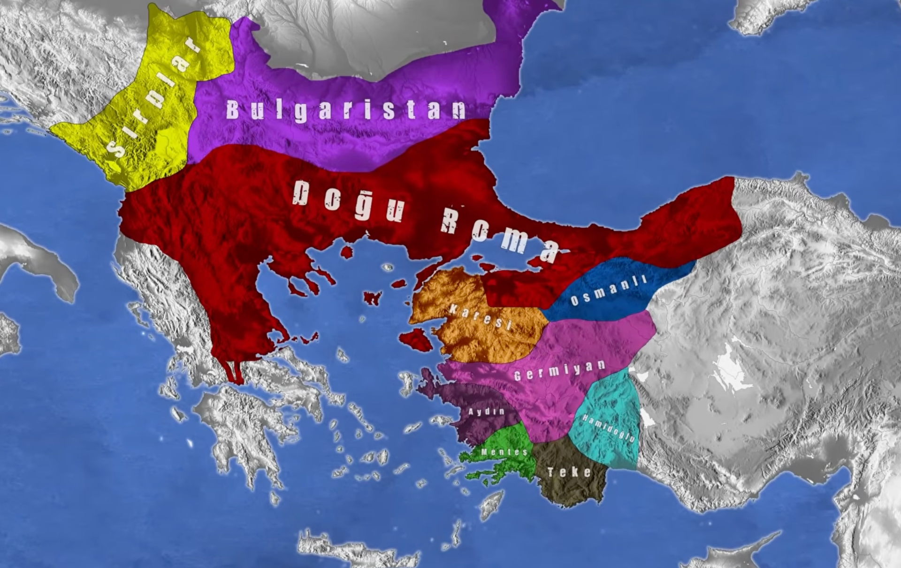

- **1077** → Anadolu Selçuklu kuruldu
- **1100–1200** → En güçlü dönem 💪
- **1230** → Zirve (en güçlü zamanlardan biri)

mogollar hassahilerin sonunu getiriyor

&nbsp;

&nbsp;

&nbsp;

&nbsp;

- Büyük Selçlu → parçalandı
- Anadolu Selçuklu → kuruldu ve büyüdü
- Moğollar → geldi ve anadolu selcukgu bitirdi
- Son → Anadolu Selçuklu bitti

anadolu selcuklu yikilirken anadoluda turk beylikleri kuruldu

1299 yilinda kurulan osmanli

&nbsp;