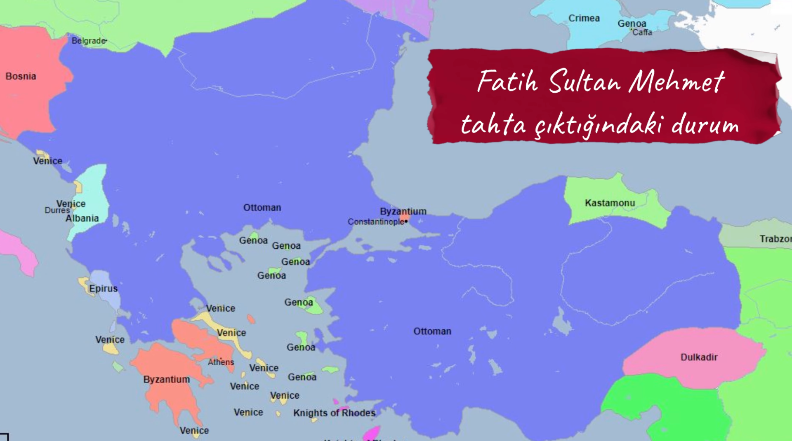
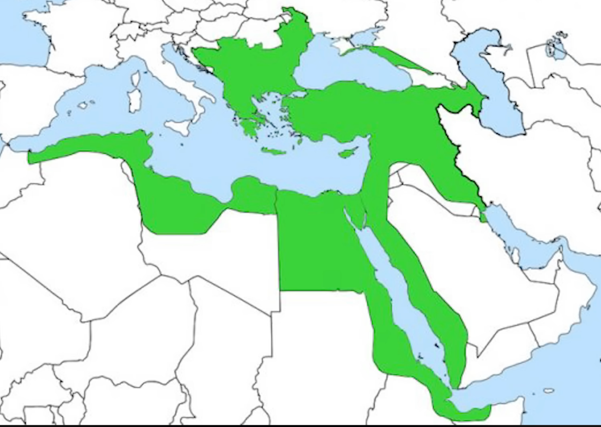

1453 fatih sultan mehmet istanbulu kazaniyor

1453 dogu roma yani bizans yok edildi ve osmanli doguda ve batida buyudu

ertugrul oglu osman gazi osamanliyi kurdu

orhan gazi sonra

&nbsp;

&nbsp;

yavuz sultan selim bagdat kudusu aldi

&nbsp;

&nbsp;

&nbsp;

en buyuk hali

&nbsp;

sonra gerileme basliyor

&nbsp;

**Kanuni Sultan Süleyman Dönemi (1520-1566):**  
Kanuni Sultan Süleyman, Osmanlı İmparatorluğu'nun en güçlü dönemlerinden birinde hüküm sürmüştür. Bu dönemde Osmanlı İmparatorluğu, genişlemiş, kültürel ve ekonomik açıdan gelişmiş ve dünyanın en güçlü imparatorluklarından biri olmuştur.  
 **Viyana Kuşatması (1529 ve 1683):**  
Osmanlı İmparatorluğu'nun Avrupa'daki genişlemesi Viyana Kuşatmaları ile sembolize edilir. Bu kuşatmalar, Osmanlı'nın Avrupa'daki nüfuzunu artırma çabasının bir parçasıydı. 1529 ve 1683 yıllarında gerçekleşen bu kuşatmalar, Osmanlı İmparatorluğu'nun Avrupa'daki ilerleyişini durdurmuş ve geri çekilmesine yol açmıştır.