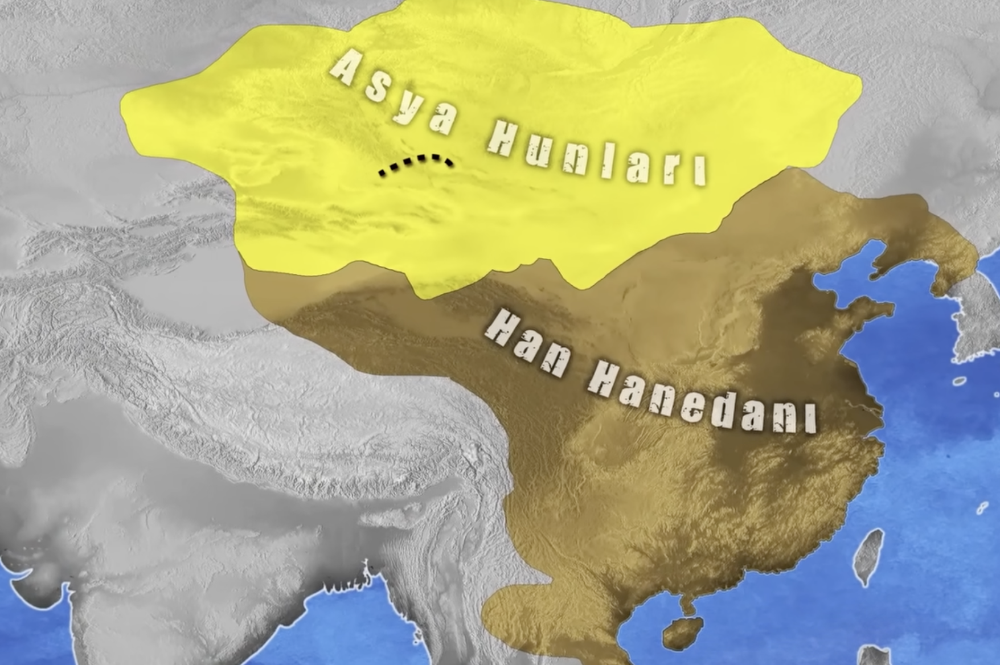
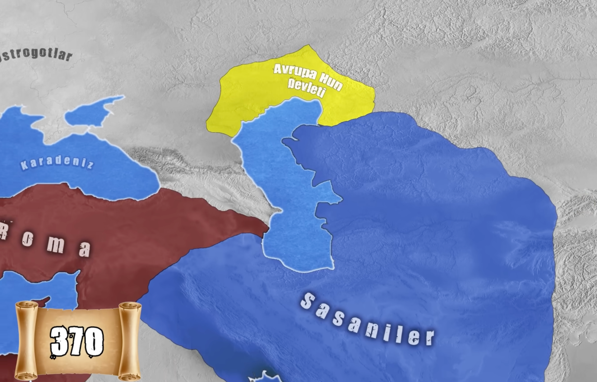

buyuk hun devleti yikildiktan sonra asya hunlari goc ederek

hazar denizi etrafinda yerlesirler ve burda yerlestikten sonra buyumeye calisirlar

&nbsp;

&nbsp;

burda buyudukten sonra vandallar ostrogotlar gibi yasayan insanlarinda goc etmesine ve romanin yapisininda degisimine neden olmustur