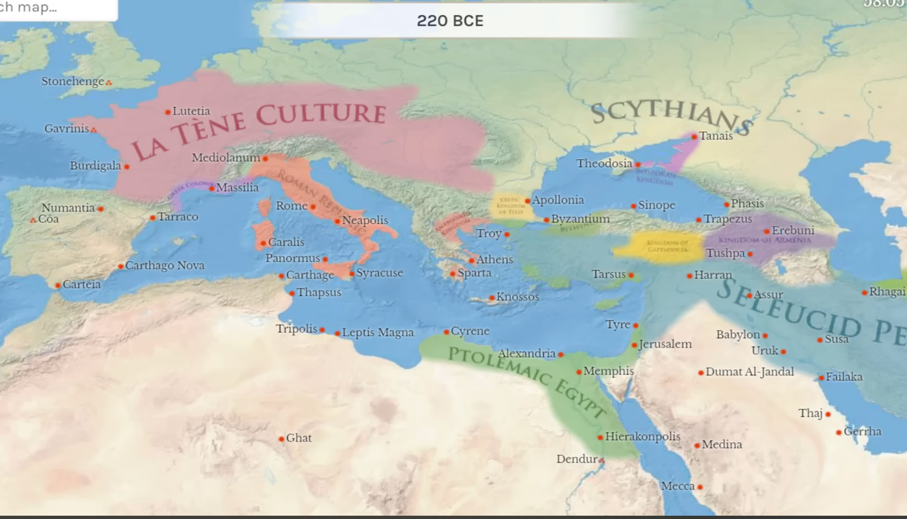
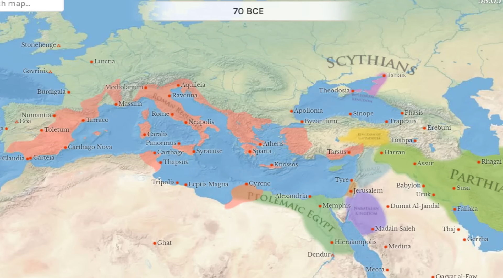
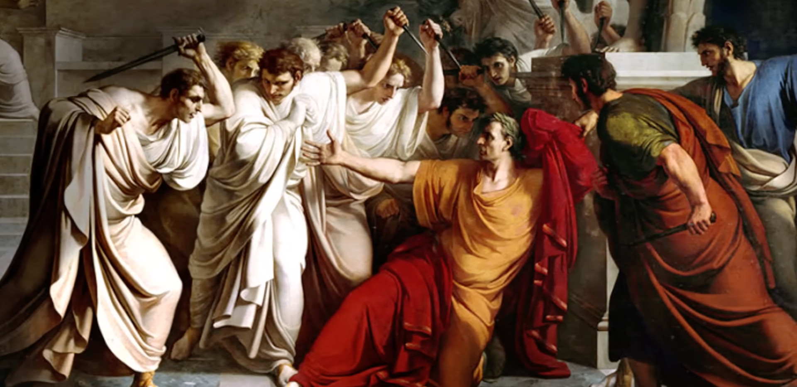
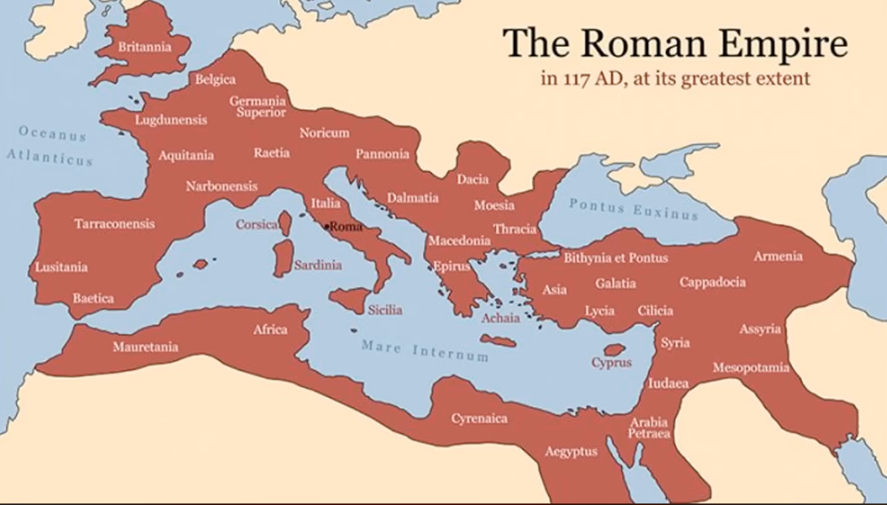
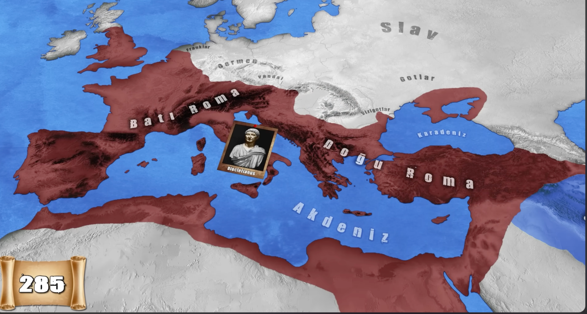
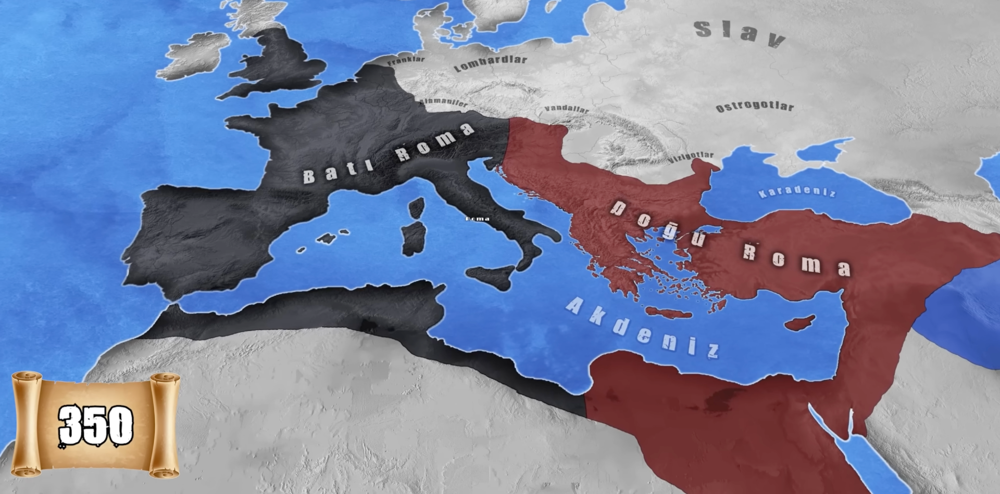

&nbsp;

surekli buyeyen roma imparatorlugu

mo 250 yillarda hanibal ortaya cikiyor ve romayla savasiyor ilk filleri kullanarak savasan insan romayi cogu yeri fethediyor sonra ordusu gucsuz kaldigindan romanin eline geciyor sonra romaya komutanlik yapiyor ama sonra intihar ediyor

&nbsp;

M.Ö. 146, Roma'nın Makedonya'yı ve Yunanistan'ı fethetmesi.

spartakus kolelige bas kaldiriyor ama sonradan olduruluyor

mo 58 sezar dunyaya geliyor galide sonra romayi yonetiyor sonradan diktatorluk yapiyor ve senato hosuna gitmiyor ve bunu olduruyorlar

markus brutusde orda sezari oldutuyor

mo 44 14 martta sezari oldurduler

&nbsp;

roma ikiye bolunur uvey oglu oktavyus ve arkadasi markusn antious sonramarcus antious misir kralicesi klopatra ile ask yasar halk bunu sevmez ve kacarlar ama bu onun olumune neden olur intihar edeler

&nbsp;

M.Ö. 30, Roma'nın Mısır'ı fethetmesi

roma gelen bir kral ulkeyi 2 ye boluyor hepsine yetisemediginden

&nbsp;

311 ic savas cikar ve constatine ve maximunus basa gelir ve 311 de hristinyaligi mesrulastirir

&nbsp;

daha sonra constatine bati ve dogu birlestirir

ve istanbulu romanin baskenti yapar

ama sonra contine olur baya lider gelir gider gelen bir kral ogullarina bati ve dogu olmak uzere yonetmesini soyler ama kavimler gucu ve kulturden dolayi ayri olur sonrasinda ulke 2 tekrardan bolunur

&nbsp;

