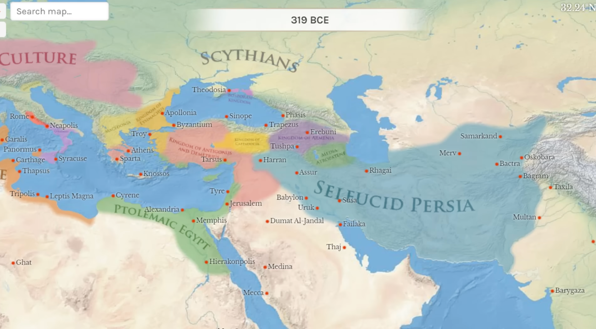
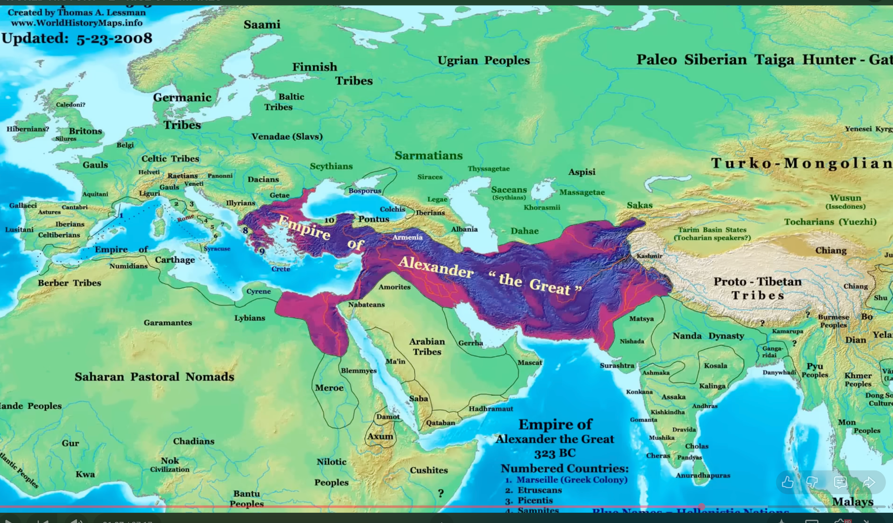

&nbsp;

m.o 336 buyuk iskender geliyor 20 yasinda makedonyaya cikan iskender once yunan devletini ele geciriyor

&nbsp;

sonra 13 yil icinde pers imparatorlugunu bitiriyor

&nbsp;

buyuk iskender oldukten sonra 4 generali ile bolusuluyor ama elde tutulamiyor

bu zamanda cin hanedanligi ilk imparatorlugunu ilan ediliyor yazi olcu birimlerine geciyorlar