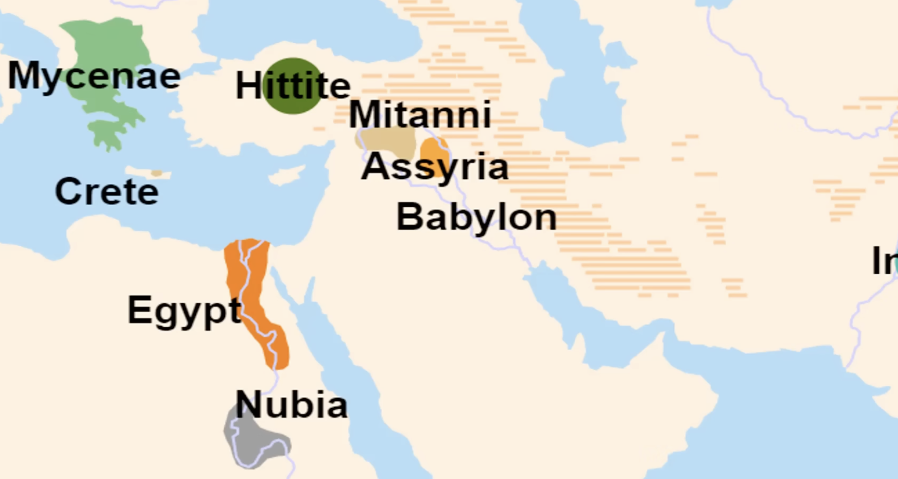
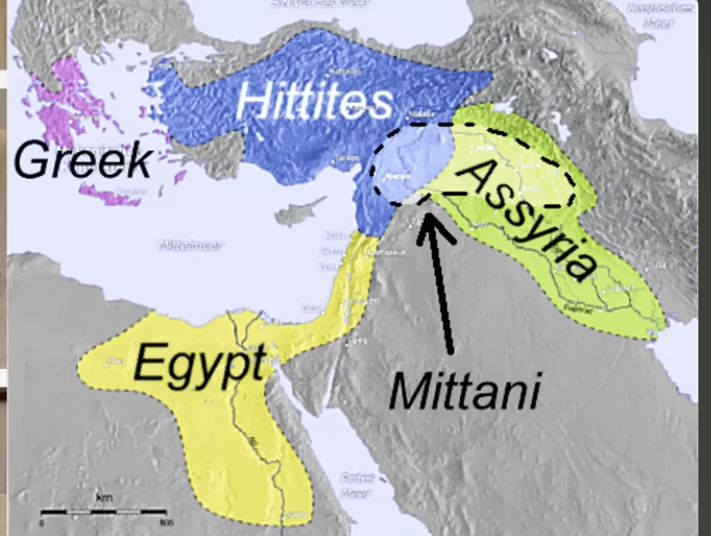

hititler ilk tank arabasini bulan toplum 

ve demir islemesini yapan ilk toplum ve ilk baris anlasmasini yapan toplum kades anlasmasi misir ile birlikte yapilir

ve bu aslinda doguda asurlular buyurken misira gel savasmayalim baris yapalim demis

yunanlilar m o 1200 yillarda demir islemesini ogrenir  
yunanlilar zeytin ve sarap ureterek takas yaparak guclenir