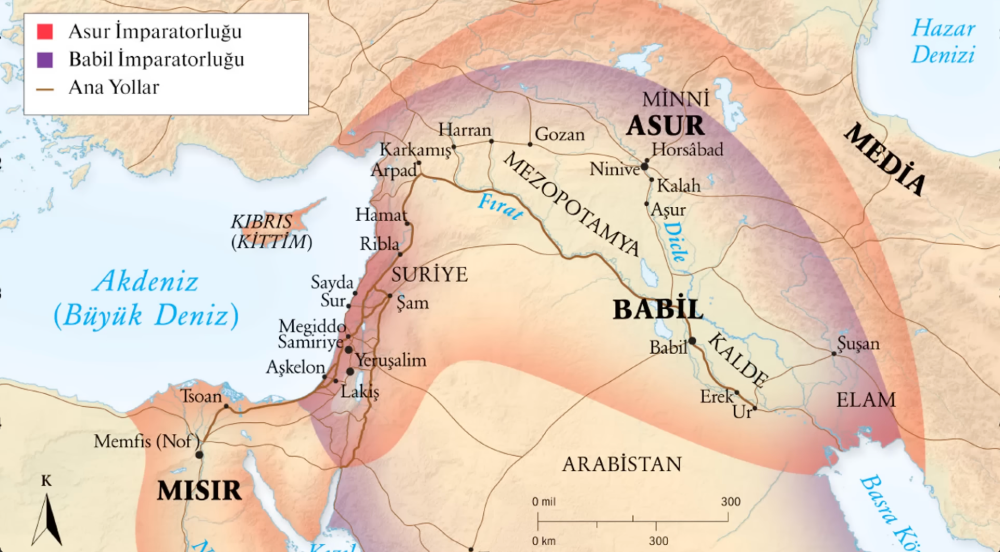

akadlar yikildiktan sonra

asur ve babil kralliklari ortaya cikiyor  
babil krali hamurabi asur krali oldukten sonra humrabi asuruda aliyor

&nbsp;

M.Ö. 1700 dolayları, HAMMURABİ tarafından insanlığın ilk yasa derlemelerinin çıkarılışı.  
282 maddelik goze goz dise dis bir yasa cikarildi  
hamurabi oldukten sonra hittiter kralligi basliyor  
orta doguda ve demir islemeyi ilk toplum oluyor

&nbsp;