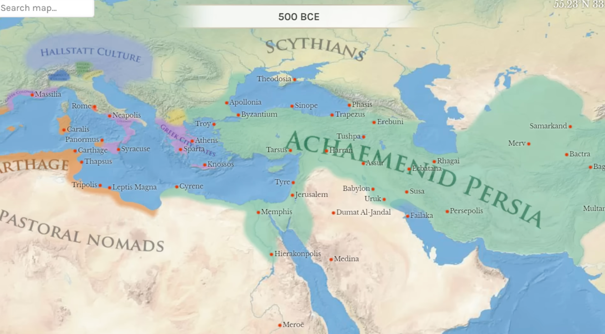
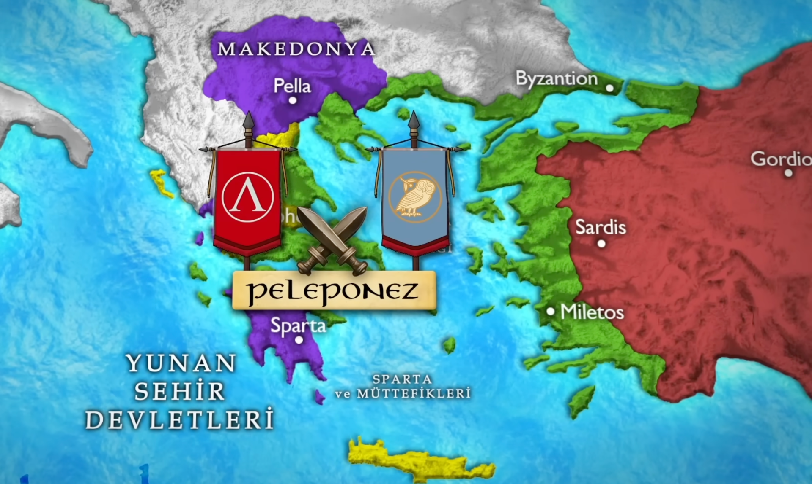
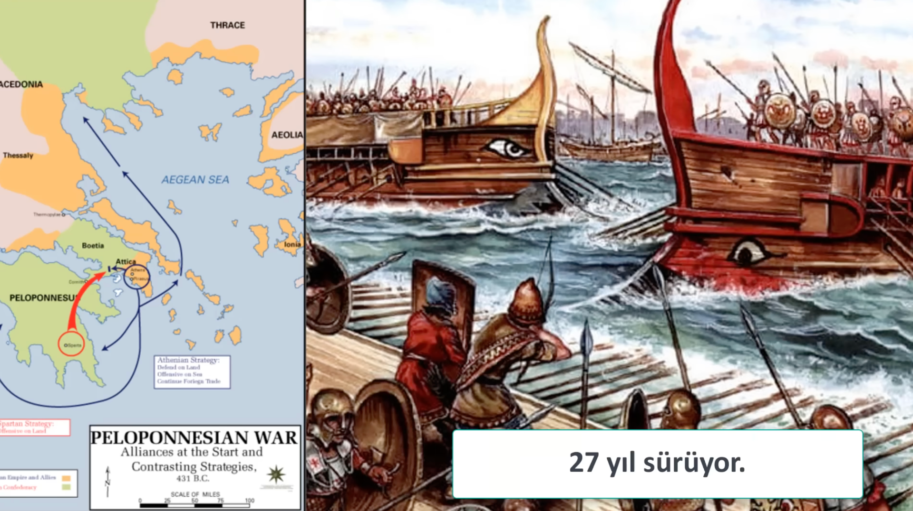

&nbsp;

persler spartalilarla savasiyor sonra

persler spartalilari fonlayip atinalarla savasmasinis sagliyor

&nbsp;

spartalilar atinalilarla savasiyor 27 yil suruyor

&nbsp;

daha sonra atinalilar persleri yeniyor m.o 500 yillarinda

&nbsp;

M.Ö. 500 dolayları, Çin uygarlık biçiminin temel öğelerinin ortaya çıkışı.